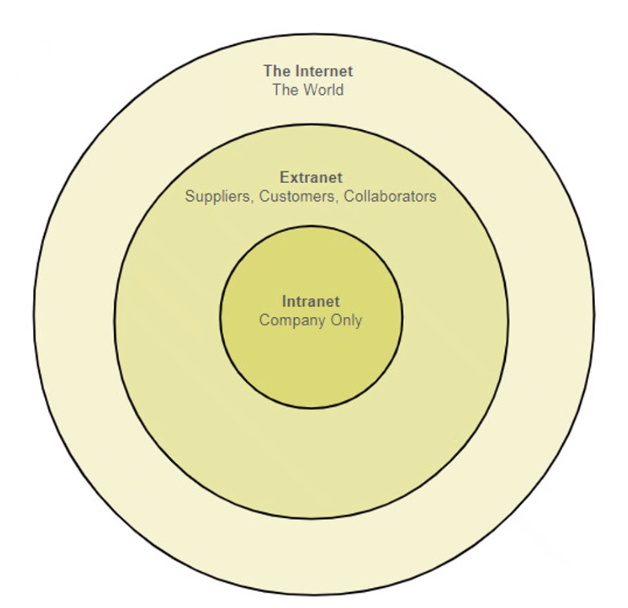

# Network Basics

## Network Components

The host is any device that is connected to the network (PC, server, mobile etc.)

In a peer-to-peer scenario, rather than the client using a server, machines will connect to each other in order to utilize a service.

An intermediary device is a device added to the network in order to connect other machines. This can come in the form of a router, hub or switch.

Network media is how data is exchanged amongst the network, such as wireless frequencies or ethernet cables.

## Infrastructure Type

**Local-area networks** (LAN) consists of devices interconnected to each other, often in a small perimeter (usually a office or home.)

**Wide-area networks** (WAN) consists of numerous LANs connected together via the internet. This connection usually comes in the form of a service provided by a network provider, however this is not necessary (some large enterprises will utilize WAN to connect several premises.)

## Internet, Intranet, Extranet

**Internet** is a large network utilized to connect devices across the world, including both public and private networks.

**Intranet** is a connection between several LANs that allow devices to connect to machines / services on a large private network.

**Extranet** similar to Intranet, is a private network, however partial resources are available to specific authorized users.

## Communication Fundamentals

**Message source** is a person, or electronic devices that wants to send a message to other individuals or devices.

**Message destination** is where the message is received and interpreted.

**Channel** is the media that provides the pathway over which the message travels for the source to the destination.

## Message Delivery Options

**Unicast** is information being sent to one device or receiver only.

**Multicast** is information being sent to multiple specified devices or receivers.

**Broadcast** is information you want to send to every device, however "every device" can be relative to a scenario, such as every device on a network segment.

## Protocol Suites

The OSI model presents how communication takes place between devices via the Internet. Each layer represents a set group of different services that are utilized in order to achieve a task. These services were developed to be universal in order to ensure that different hardware could communicate.

1. **Physical** is the lowest level of the OSI stack and as such operates in bits. The physical layer is responsible for the encoding and signaling necessary to transform data frrom bits to signals that can be sent across a network.

2. **Data Link** it the second lowest level in the OSI stack and is responsible for accomodating the flow of data and ensuring data arrives in it's destination error free by utilizing timers.

3. **Network** is the layer responsible for assigning an IP address to devices on the local network. Additionally, the network layer is responsible for delivering data to the correct end-point.

4. **Transport**

- Transmission Control Protocol (TCP) is utilized when the sender wants to ensure that all data is received. This is achieved by the receiver sending an acknowledgement of delivery (causing a delay). TCP is often used when downloading large amounts of data.

- User Datagram Protocol (UDP) is utilized when data sent does not need to be ensured that it has been delivered, and instead favours delivery time over reliability. UDP is often used on video streaming platforms / services.

5. **Session, Presentation and Application** are often looked at as a similar group, due to how they are presented in the OSI model. They are used in order to differentiate numerous on-going services being utilized on a machine.

### TCP/IP Model

Despite being designed prior to the OSI model, the TCP/IP model features a more streamlined layout of layers (only utilizing four layers) and is the model that is implemented in real-world scenarios.

Both the TCP and UDP transport layer protocols utilize port numbers in order to manage numerous simultaneous conversations. Destination port numbers are associated with a destination application on the server host.
