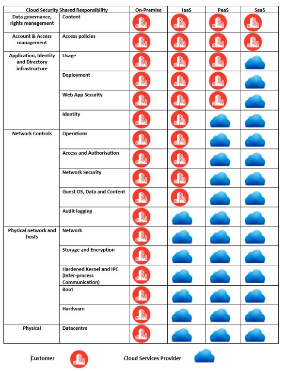

# Cloud Computing

Cloud computing is the external delivery of resources to your physical machine from across a network.  Cloud computing can account for reources such as, platforms, storage, data and services. The three main benefits of cloud computing are flexibility, efficiency and cost.

Flexibility, efficiency and cost comes in the form of the scalability of resouruces allocated to services / platforms in the cloud. As an example, this gives companies the ability to scale up or down based on expected traffic or load. This allows companies to more easily prioritize their requirements at a specific time as opposed to the past where a company would have to take more into consideration, such as cost and future-proofing before building infrastructure.

## Concerns and Risks

As more companies rely heavily on cloud computing for their daily workload, the potential threat surface area increases. If a vulnerabilty were to be exploited within one of these cloud computing service providers infrastructure, this would present an issue to all clients utilizing the infrastructure.

## Deployment Types

**Public** cloud computing is a service owned and operated by a third-party service provider that they allow the public to lease or utilize.

**Private** cloud computing is when you host your own services and infrastructure to allow for cloud computing.

**Hybrid** cloud computing is when you utilize a mixture of both resources for different functionality purposes within a system or infrastructure.

IaaS - Infrastructure as a Service is the utilization of third-party hardware and networks.

PaaS - Platform as a Service is the same as IaaS, however underlying software structure is also supplied by the third-party on-top.

SaaS - Software as a service is when the full package is supplied under a lease from a third-party, including hardware, infrastructure software as well as applicaiton software.

## Virtualizaton vs Cloud computing

The concept of virtualization forms the base for cloud computing, due to the fact that virtualization assists in the delivery of shared computer resources, data and / or software.
